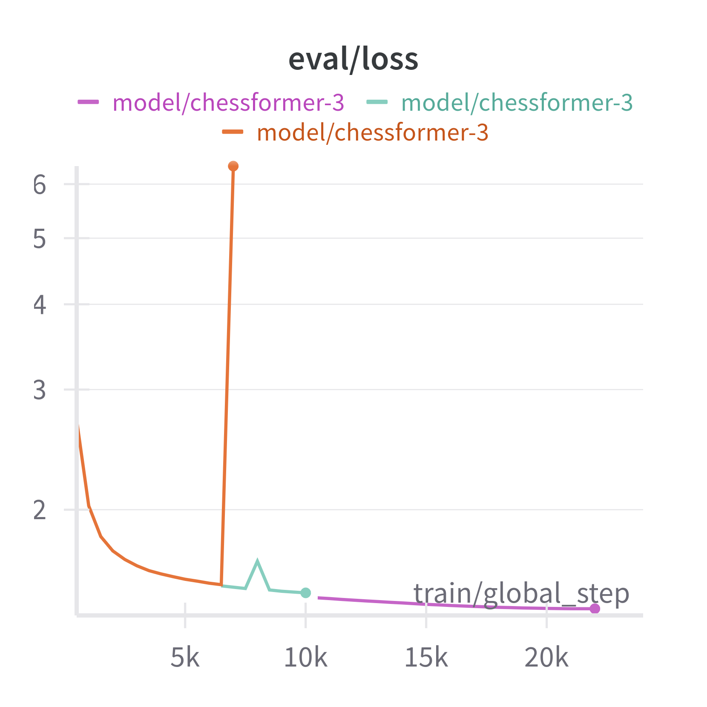
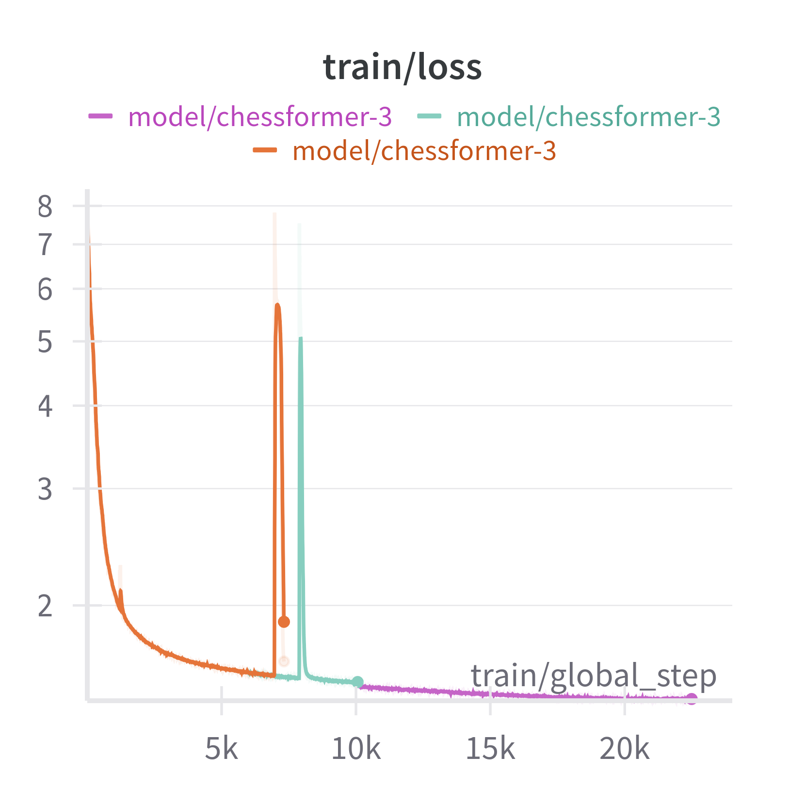
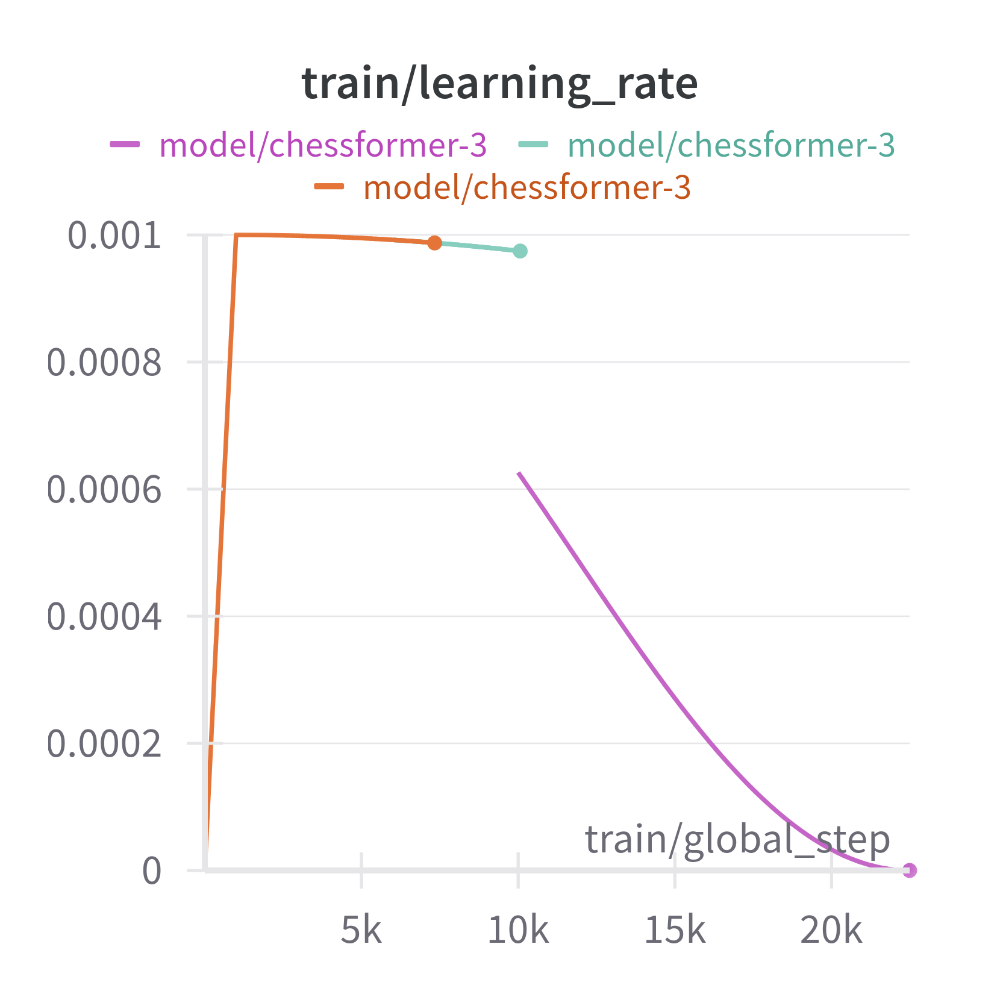
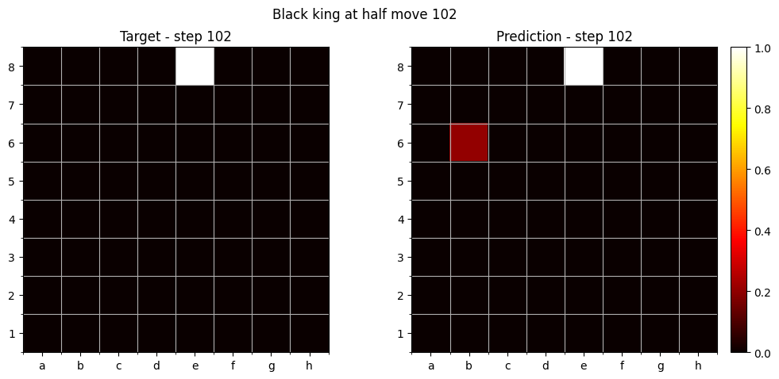
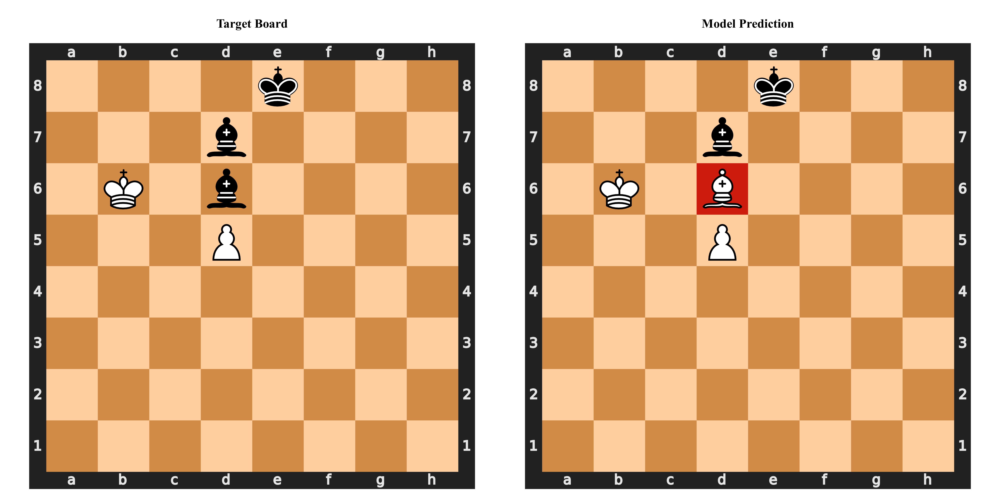

# Reproduction of the Chessformer model

[](https://huggingface.co/nsarrazin/chessformer)

This is a collection of scripts that I used to train my [chessformer](https://huggingface.co/nsarrazin/chessformer) model.

It's a 231M parameter model, trained on 4.4B tokens of lichess games. The games are represented as UCI moves, with each token being a move.

The goal was not to achieve very good ELO performance, but to have a model based on a well known architecture for LLMs that can then be analyzed for interpretability. See this notebook for more info.

> [!WARNING]
> Like all weekend projects, I didn't really document along, so I just collected my scripts after the fact. Things might or might not work, I'm happy to answer questions and provide some support on a best effort basis though!

## Inference
```py
from transformers import GPT2LMHeadModel, AutoTokenizer

model = GPT2LMHeadModel.from_pretrained("nsarrazin/chessformer").eval()
tokenizer = AutoTokenizer.from_pretrained("nsarrazin/chessformer")

moves = " ".join(["e2e4", "e7e5", "d2d4", "d7d5"])

model_inputs = tokenizer(moves, return_tensors="pt")
gen_tokens = model.generate(**model_inputs, max_new_tokens=1)[0]
next_move = tokenizer.decode(gen_tokens[-1])

print(next_move) #d4e5
```

### End of game detection

The model also has three special tokens for end game detection `<BLACK_WIN>`, `<WHITE_WIN>` and `<DRAW>`. This can be useful for implementing beam search strategies. 

```py
moves = " ".join(["f2f3", "e7e5", "g2g4", "d8h4"])

model_inputs = tokenizer(moves, return_tensors="pt")
gen_tokens = model.generate(**model_inputs, max_new_tokens=1)[0]
next_move = tokenizer.decode(gen_tokens[-1])

print(next_move) # <BLACK_WIN>
```


### Training run

The model was trained on a single H100 for about 48 hours over the course of a few days.

| Eval Loss | Train Loss | Learning Rate |
|:---:|:---:|:---:|
|  |  |  |


The loss has some really big upward spikes. If I had to guess it's because there are some really rare tokens in UCI notation for pawn promotion moves. For example `b2a1q` is a pawn promotion move (black pawn goes from b2 to a1 by capturing and becomes a queen) but it's unlikely that the model will see all these cases in the training set. When the model sees an untrained promotion move, the loss will spike.

I also messed up my learning rate scheduling initially, had to stop the run to fix it. Don't think it impacted the model too much but something to do better next time.

You can find the training script [here](train.py) and the script used for creating the tokenizer [here](tokenizer.py).

### Interpretability

I'm working on some experiments regarding interpretability. You can find the results in this [notebook](notebooks/probes.ipynb). I've used linear probes to visualize how well the model "sees" the board.





### What I would like to do next

- Try curriculum learning: At first train on all kind of games and then bias towards high ELO games as the learning rate decreases.

- Improve tokenization by adding tokens for promotion and deprecating the uci notation so that `b2a1q` would become `b2a1 <PROMOTE_QUEEN>`. That way the model would only have to train on 4 kind of promotion moves (q, r, b, k)

- Fine tune the modle using reinforcement learning. using stockfish centipawns as a reward function.

- Train sparse autoencoders on the model's layers to see what kind of features the model learns to represent.
